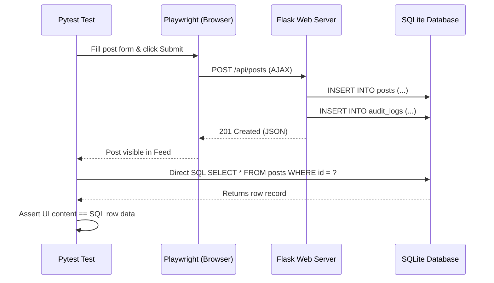

# 🚀 Social Media Dashboard – Test Automation Framework

[](https://www.python.org/)
[](https://playwright.dev/python/)
[](https://docs.pytest.org/)
[-orange)](#-architecture--design-patterns)
[](#-sql-database-verification)
[](.github/workflows/tests.yml)

An enterprise-grade, end-to-end Test Automation Framework built with **Python**, **Playwright**, and **Pytest** implementing the **Page Object Model (POM)** pattern. 

The framework is paired with a modern, glassmorphic **Social Media Dashboard web application** (`app/`) with a real **SQLite database backend** (`database/social_dashboard.db`). In addition to automating browser UI interactions, the test framework executes **direct SQL queries** against the database to guarantee that all user actions (logins, posts, likes, deletions, audit logs) are atomically and accurately persisted.

---

## 🌟 Key Capabilities & Highlights

1. **Page Object Model (POM) Architecture**: Clean separation of page locators, actions, and test assertions (`framework/pages/`).
2. **End-to-End Functional & Negative Testing**:
   - Authentication (valid credentials, invalid passwords, non-existent users, SQL injection rejection, session logout).
   - Sidebar and multi-view navigation with active route assertions.
   - Post lifecycle management (creation, character limits, platform tagging, post deletion, real-time liking, feed filtering).
   - Dynamic data display (follower metrics, impression counters, engagement rates).
3. **Direct SQL Database Verification (`framework/utils/db_helper.py`)**:
   - Verifies row insertion into `posts` table with matching schema and user relationships.
   - Asserts real-time row deletion upon frontend post removal.
   - Validates like count increment in the database matches UI counter state.
   - Verifies automated `audit_logs` tracking user login and content operations.
   - Asserts total UI post card count matches raw SQL table count (`SELECT COUNT(*) FROM posts`).
4. **Automated Regression Suite (`tests/test_regression_suite.py`)**:
   - End-to-end user journey validating stability before releases.
5. **Interactive HTML Reporting & Screenshots**:
   - Self-contained HTML execution reports with pass/fail metrics.
   - Automated screenshot capture upon test failure.
6. **GitHub Actions CI/CD Pipeline**:
   - Automated test execution on every `push` and `pull_request`.
   - Automatic artifact upload of HTML test reports and screenshots.

---

## 🏛 Architecture & Design Patterns

```
social-media-dashboard-automation/
│
├── .github/
│   └── workflows/
│       └── tests.yml               # GitHub Actions CI/CD pipeline
│
├── app/                            # Application Under Test (Social Media Dashboard)
│   ├── static/
│   │   ├── css/dashboard.css       # Premium Dark Glassmorphic Design
│   │   └── js/dashboard.js         # Client-side dynamic feed & metrics logic
│   ├── templates/
│   │   ├── base.html               # Base layout
│   │   ├── login.html              # Authentication view
│   │   └── dashboard.html          # Main metrics & post management view
│   ├── database.py                 # SQLite schema, connections & initial seed data
│   ├── models.py                   # Data Access Layer (Users, Posts, Metrics, Audit)
│   └── server.py                   # Flask server & REST API endpoints
│
├── framework/                      # Automation Core Framework
│   ├── config/
│   │   └── config.py               # Environment variables, timeouts, URLs, browser toggles
│   ├── data/
│   │   └── test_data.py            # Positive/negative credentials, post payloads, boundaries
│   ├── pages/                      # Page Object Model (POM)
│   │   ├── base_page.py            # Playwright browser interaction wrapper
│   │   ├── login_page.py           # Login view locators & actions
│   │   ├── dashboard_page.py       # Metrics cards & stat display locators
│   │   ├── posts_page.py           # Post creation, deletion, like & filter actions
│   │   └── navigation_page.py      # Sidebar routes & logout actions
│   └── utils/
│       ├── db_helper.py            # Direct SQL execution & assertion engine
│       └── logger.py               # Standardized test logger
│
├── tests/                          # Pytest Test Suites
│   ├── conftest.py                 # Server lifecycle, Playwright fixtures, DB reset, HTML hooks
│   ├── test_login.py               # Positive & negative auth tests, security checks
│   ├── test_navigation.py          # View switching & URL route tests
│   ├── test_post_management.py     # Post creation, boundaries, deletion, and likes
│   ├── test_data_display.py        # Metrics cards & counter sync verification
│   ├── test_sql_verification.py    # Direct SQL assertions vs UI actions
│   └── test_regression_suite.py    # Complete pre-release end-to-end regression flow
│
├── reports/                        # Target directory for report.html & failure screenshots
├── database/                       # SQLite database file directory
├── pytest.ini                      # Pytest configuration & custom markers
├── requirements.txt                # Pinned project dependencies
├── run_tests.py                    # Unified CLI test runner & server launcher
└── README.md                       # Documentation
```

---

## 🗄 SQL Database Verification

The framework connects directly to SQLite (`database/social_dashboard.db`) during UI test executions using `DatabaseHelper`.



### Database Schema Tested
- `users`: `id`, `username`, `password_hash`, `full_name`, `email`, `role`, `created_at`
- `posts`: `id`, `user_id`, `platform`, `content`, `media_url`, `likes_count`, `comments_count`, `status`, `created_at`
- `metrics`: `id`, `user_id`, `total_followers`, `total_impressions`, `engagement_rate`, `last_updated`
- `audit_logs`: `id`, `user_id`, `action`, `details`, `timestamp`

---

## 🔑 Pre-seeded Test Credentials

| Role | Username | Password | Email |
| :--- | :--- | :--- | :--- |
| **Standard User** | `testuser` | `Password@123` | `sarah@socialpulse.io` |
| **Administrator** | `admin` | `Admin@123` | `alex@socialpulse.io` |
| **QA Tester** | `qa_tester` | `QASecret#2026` | `david@socialpulse.io` |

---

## 🚀 Quickstart & Installation

### 1. Clone the Repository
```bash
git clone https://github.com/yogeshmagatam/Social-media-dashboard-automation.git
cd Social-media-dashboard-automation
```

### 2. Set Up Virtual Environment
```bash
# Windows
python -m venv venv
venv\Scripts\activate

# Linux / macOS
python3 -m venv venv
source venv/bin/activate
```

### 3. Install Dependencies & Playwright Browsers
```bash
pip install -r requirements.txt
playwright install chromium
```

---

## 🧪 Running Tests

You can run tests using either the unified `run_tests.py` CLI runner or native `pytest` commands.

### Option A: Using the CLI Runner (`run_tests.py`)

```bash
# Run all tests (headless mode by default)
python run_tests.py

# Run in headed mode (see the browser in action)
python run_tests.py --headed

# Run specific marker suite (e.g. smoke, regression, db, posts)
python run_tests.py -m smoke
python run_tests.py -m db
python run_tests.py -m regression

# Start only the web app for manual exploration
python run_tests.py --app-only
```

### Option B: Using Pytest Directly

```bash
# Run all tests with HTML report
python -m pytest tests/ -v

# Run direct SQL database verification tests
python -m pytest tests/test_sql_verification.py -v

# Run authentication suite (positive + negative)
python -m pytest tests/test_login.py -v

# Run full pre-release regression suite
python -m pytest tests/test_regression_suite.py -v
```

---

## 📊 Test Reporting & Artifacts

After every test run, a self-contained HTML report is generated at:
```
reports/report.html
```

- To view the report, open `reports/report.html` in any browser.
- In the event of a test failure, a full-page screenshot is captured and saved automatically to:
  ```
  reports/screenshots/FAIL_<test_name>.png
  ```

---

## 🔄 CI/CD Pipeline (GitHub Actions)

The repository includes a ready-to-run GitHub Actions workflow located at `.github/workflows/tests.yml`:
1. Checks out repository code.
2. Configures Python 3.12 with pip cache.
3. Installs dependencies and Playwright Chromium headless shell.
4. Executes the full Pytest test suite with automatic test server lifecycle.
5. Archives and uploads `report.html` and failure screenshots as build artifacts retained for 14 days.

---

## 📝 Test Coverage Summary

| Test Suite | File | Markers | Scenarios Tested |
| :--- | :--- | :--- | :--- |
| **Authentication** | `test_login.py` | `smoke`, `auth` | Valid login, admin login, invalid password, nonexistent user, SQL injection attempt, empty form submission, logout & session invalidation. |
| **Navigation** | `test_navigation.py` | `smoke`, `navigation` | Route switching (Dashboard, Posts, Analytics, Settings), active tab CSS highlighting, page header rendering. |
| **Post Management** | `test_post_management.py` | `functional`, `posts` | Post publishing, media attachments, real-time character counter, 280-char boundary validation, empty post rejection, post liking, post deletion, platform filtering. |
| **Data Display** | `test_data_display.py` | `functional`, `metrics` | Followers, impressions, engagement, post counter formatting, and live counter updates on post additions/deletions. |
| **SQL Verification** | `test_sql_verification.py` | `db`, `regression` | Direct SQL checks on `posts` row creation, status, like count synchronization, deletion removal, login audit logs, and feed vs database row parity. |
| **E2E Regression** | `test_regression_suite.py` | `regression` | End-to-end workflow from auth failure check to login, navigation, post creation, SQL validation, post deletion, and logout. |

---

## 📄 License
This project is open-source and available under the [MIT License](LICENSE).
